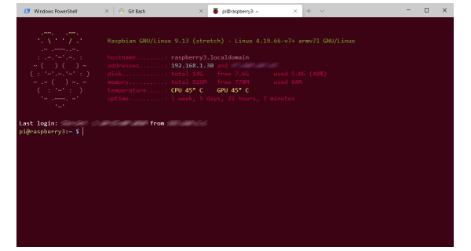

# Raspberry Pi

## .bash_aliases
Some convenience bash aliases. Basically the bare minimum. :-)
```
alias ..='cd ..'
alias ...='cd ../..'
alias cd..='cd ..'
alias md='mkdir -p'
alias rd='rmdir'
alias ll='ls -l'
```

## 10-motd-berry, 10-motd-telly
Scripts to generate a dynamic "message of the day" for the Raspberry Pi.

