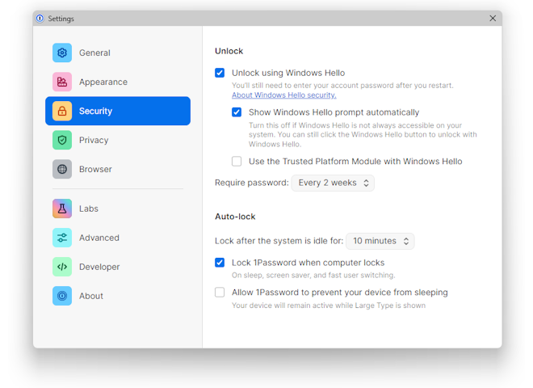
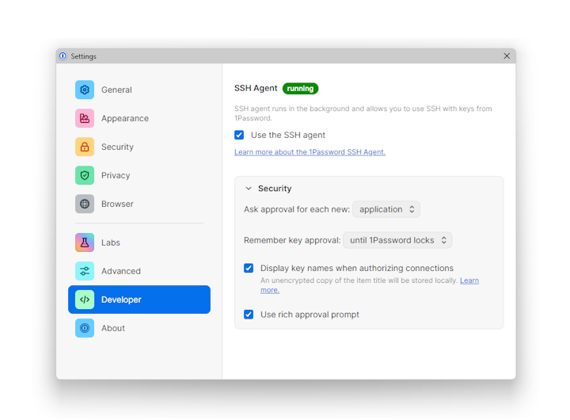
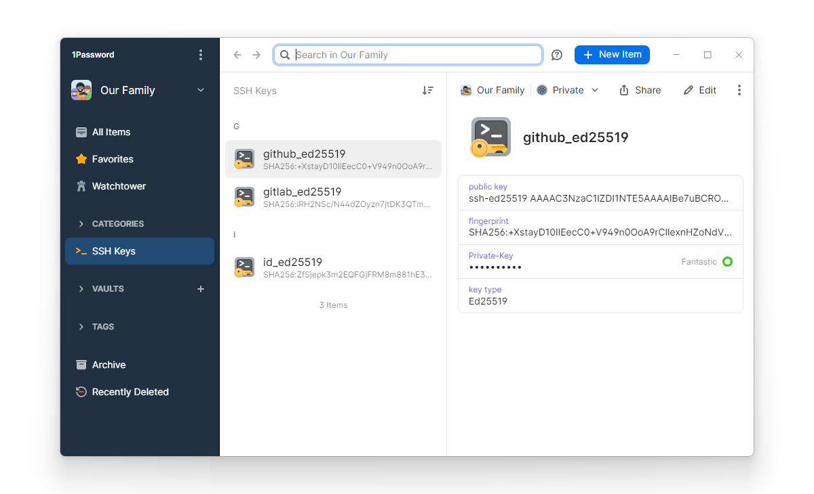

# SSH Config 201


<div class="page"/>

# Different Aliases and Identities
```
Host raspberry pi.hole
  Hostname pi.hole
  IdentityFile ~/.ssh/id_ed25519
  User pi

Host github.com
  Hostname github.com
  IdentityFile ~/.ssh/github_ed25519
  User git

Host gitlab.com
  Hostname gitlab.com
  IdentityFile ~/.ssh/gitlab_ed25519
  User git
```
Using different SSH keys for different servers or services like your raspberry pi, github, gitlab, etc.

# ~/.ssh/config (continued)
```
Host *
  AddKeysToAgent yes
  IdentitiesOnly yes
  User michael
```
Advanced settings, catch-alls, defaults and wildcards.

<div class="page"/>

# Training Exercise
```
$ ssh github.com
Enter passphrase for key '/c/Users/michael/.ssh/github_ed25519':
PTY allocation request failed on channel 0
Hi mosterme! You've successfully authenticated, but GitHub does not provide shell access.
Connection to github.com closed.
```

```
$ ssh -v github.com
OpenSSH_9.2p1, OpenSSL 1.1.1t  7 Feb 2023
debug1: Reading configuration data /c/Users/michael/.ssh/config
debug1: /c/Users/michael/.ssh/config line 24: Applying options for github.com
debug1: /c/Users/michael/.ssh/config line 34: Applying options for *
debug1: Connecting to github.com [140.82.121.4] port 22.
debug1: Connection established.
debug1: identity file /c/Users/michael/.ssh/github_ed25519 type 3
debug1: identity file /c/Users/michael/.ssh/github_ed25519-cert type -1
debug1: Authenticating to github.com:22 as 'git'
debug1: SSH2_MSG_KEXINIT sent
debug1: SSH2_MSG_KEXINIT received
debug1: kex: algorithm: curve25519-sha256
debug1: kex: host key algorithm: ssh-ed25519
debug1: kex: server->client cipher: chacha20-poly1305@openssh.com MAC: <implicit> compression: zlib@openssh.com
debug1: kex: client->server cipher: chacha20-poly1305@openssh.com MAC: <implicit> compression: zlib@openssh.com
debug1: expecting SSH2_MSG_KEX_ECDH_REPLY
debug1: SSH2_MSG_KEX_ECDH_REPLY received
debug1: Server host key: ssh-ed25519 SHA256:+DiY3wvvV6TuJJhbpZisF/zLDA0zPMSvHdkr4UvCOqU
debug1: Host 'github.com' is known and matches the ED25519 host key.
debug1: Found key in /c/Users/michael/.ssh/known_hosts:3
```

<div class="page"/>

# Training Exercise (continued)
```
debug1: SSH2_MSG_NEWKEYS sent
debug1: expecting SSH2_MSG_NEWKEYS
debug1: SSH2_MSG_NEWKEYS received
debug1: Will attempt key: github_ed25519 ED25519 SHA256:1pvzcZIoac8pFpJLiN0gsYI8KvX5u746m5Ja7rGuUmE explicit
debug1: SSH2_MSG_EXT_INFO received
debug1: SSH2_MSG_SERVICE_ACCEPT received
debug1: Authentications that can continue: publickey
debug1: Next authentication method: publickey
debug1: Offering public key: github_ed25519 ED25519 SHA256:1pvzcZIoac8pFpJLiN0gsYI8KvX5u746m5Ja7rGuUmE explicit
debug1: Server accepts key: github_ed25519 ED25519 SHA256:1pvzcZIoac8pFpJLiN0gsYI8KvX5u746m5Ja7rGuUmE explicit
Enter passphrase for key '/c/Users/michael/.ssh/github_ed25519':
debug1: Enabling compression at level 6.
Authenticated to github.com ([140.82.121.4]:22) using "publickey".
debug1: channel 0: new session [client-session] (inactive timeout: 0)
debug1: Entering interactive session.
debug1: pledge: filesystem
debug1: client_input_global_request: rtype hostkeys-00@openssh.com want_reply 0
debug1: pledge: fork
PTY allocation request failed on channel 0
debug1: client_input_channel_req: channel 0 rtype exit-status reply 0
Hi mosterme! You've successfully authenticated, but GitHub does not provide shell access.
debug1: channel 0: free: client-session, nchannels 1
Connection to github.com closed.
Transferred: sent 2300, received 2580 bytes, in 0.2 seconds
Bytes per second: sent 11654.8, received 13073.6
debug1: Exit status 1
```

<div class="page"/>

# [1Password SSH Agent](https://developer.1password.com/docs/ssh/agent)
## Requirements (Windows)
* [1Password 8](https://1password.com/downloads/)
* [Microsoft OpenSSH](https://docs.microsoft.com/en-us/windows-server/administration/openssh/openssh_overview)
* [Windows Hello](https://support.1password.com/windows-hello/) to unlock 1Password

## Configure 1Password
1. Configure [Windows Hello](https://support.microsoft.com/en-us/windows/learn-about-windows-hello-and-set-it-up-dae28983-8242-bb2a-d3d1-87c9d265a5f0)
2. (Security) Unlock using Windows Hello
3. (Developer) Use SSH agent
4. (Developer) Ask approval for each new: application





<div class="page"/>

# 1Password SSH Keys


<div class="page"/>

# Configure Git (Windows)
Configure the [core.sshCommand](https://git-scm.com/docs/git-config#Documentation/git-config.txt-coresshCommand) in your Git config to use [Microsoft OpenSSH](https://docs.microsoft.com/en-us/windows-server/administration/openssh/openssh_overview).
```
$ git config --global core.sshCommand "C:/Windows/System32/OpenSSH/ssh.exe"
````
You can also manually edit your [.gitconfig](https://git-scm.com/book/en/v2/Getting-Started-First-Time-Git-Setup#:~:text=On%20Windows%20systems) file.
```
[core]
  sshCommand = C:/Windows/System32/OpenSSH/ssh.exe
```

&#160;

&#160;

# Links

* [SSH Config 101 - aliases, host configuration, key creation and exchange](https://mosterme.github.io/misc/slides/ssh_config/ssh_config_101.html)
* [Why SSH security practices need to change](https://blog.1password.com/ssh-security-practices-changing/) - [1Password Blog](https://blog.1password.com/)
* [1Password for SSH changed the way I work](https://blog.1password.com/1password-ssh-changed-how-i-work/) - [1Password Blog](https://blog.1password.com/)
* [1Password SSH Agent](https://developer.1password.com/docs/ssh/agent) - [1Password Developer Documentation](https://developer.1password.com/)
* [1Password for SSH & Git](https://developer.1password.com/docs/ssh/) - [1Password Developer Documentation](https://developer.1password.com/)
* [SSH and Git, meet 1Password](https://blog.1password.com/1password-ssh-agent/) - [1Password Blog](https://blog.1password.com/)
* YouTube - GPN21 - Leyrer : [Noch besser leben mit SSH](https://www.youtube.com/watch?v=encBJyIO70w)