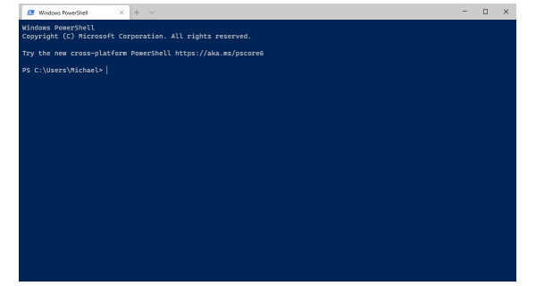
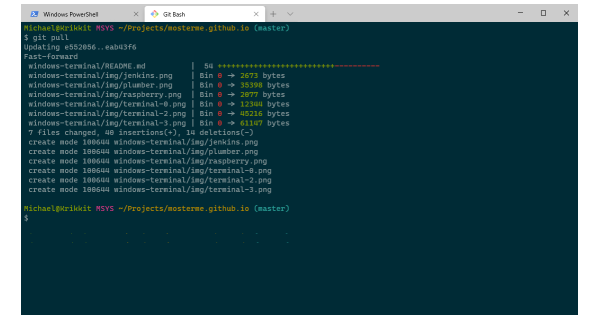
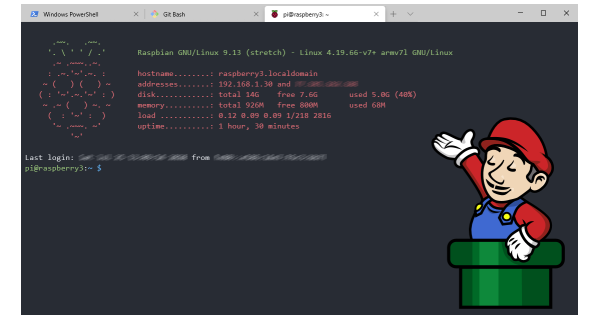

# Windows Terminal

[Windows Terminal](https://aka.ms/terminal) is a new, modern, feature-rich, productive terminal application for command-line users.

It includes many features like support for tabs, rich text, globalization, configurability, theming & styling, and more.
 
Windows Terminal will automatically create Windows Subsystem for Linux (WSL) and PowerShell profiles for you.

Upon installing the terminal, it will set PowerShell as your default profile.




## Hot-Key

---------- | ----------
`❖` + `1` | blabla
`Alt` + `Enter` or `F11` | toggle full screen
`Ctrl` + `Mouse wheel` | change text size
`Ctrl` + `0` | restore default text size
`Ctrl` + `Tab` | switch to the next tab

## Git Bash


```javascript
	{
		"guid": "{00000000-0000-0000-ba54-000000000001}",
		"name": "Git Bash",
		"commandline": "\"%PROGRAMFILES%\\git\\usr\\bin\\bash.exe\" -i -l",
		"colorScheme": "Solarized Dark",
		"fontFace": "Cascadia Code",
		"icon": "%PROGRAMFILES%\\git\\mingw64\\share\\git\\git-for-windows.ico",
		"startingDirectory": "%USERPROFILE%",
		"suppressApplicationTitle": true,
	},
```

## SSH Session
Windows 10 has a built-in SSH client that you can use in Windows Terminal.



```javascript
	{
		"guid": "{00000000-0000-0000-ba54-000000000002}",
		"name": "Raspberry 3",
		"commandline": "ssh pi@raspberry3.localdomain",
		"colorScheme": "One Half Dark",
		"fontFace" : "Consolas",
		"icon": "%USERPROFILE%\\Pictures\\raspberry.png",
		"backgroundImage": "%USERPROFILE%\\Pictures\\plumber.png",
		"backgroundImageStretchMode": "none",
		"backgroundImageAlignment": "bottomRight",
	},
```
	
## Color Schemes

```javascript
	{
		"name": "Nord",
		"foreground": "#D8DEE9",
		"background": "#2E3440",
		"black": "#3B4252",
		"red": "#BF616A",
		"green": "#A3BE8C",
		"yellow": "#EBCB8B",
		"blue": "#81A1C1",
		"purple": "#B48EAD",
		"cyan": "#88C0D0",
		"white": "#E5E9F0",
		"brightBlack": "#4C566A",
		"brightRed": "#BF616A",
		"brightGreen": "#A3BE8C",
		"brightYellow": "#EBCB8B",
		"brightBlue": "#81A1C1",
		"brightPurple": "#B48EAD",
		"brightCyan": "#88C0D0",
		"brightWhite": "#E5E9F0"
	},
```
